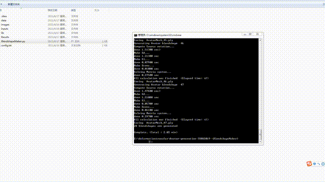

# BlendShapeMaker
BlendShapeMaker python3.6 version  
this is very useful for make blendshapes!
after i download the [code](https://github.com/diegothomas/Avatar-generation-3DRW2019-), i change it to python3 version.
  
This code is made for academic researhc use only.

If you use part of this code for your research please cite the following paper:

@INPROCEEDINGS{, author = {Hayato Onizuka and Diego Thomas and Hideaki Uchiyama and {Rin-ichiro} Taniguchi}, title = {Landmark-guided deformation transfer of template facial expressions for automatic generation of avatar blendshapes}, booktitle = {3D Reconstruction in the Wild Workshop (3DRW), part of the 2019 International Conference on Computer Vision (ICCV)}, year = {2019}, month = {10}, }
# reference 
[Landmark-guided deformation transfer of template facial expressions for
automatic generation of avatar blendshapes](https://openaccess.thecvf.com/content_ICCVW_2019/papers/3DRW/Onizuka_Landmark-Guided_Deformation_Transfer_of_Template_Facial_Expressions_for_Automatic_Generation_ICCVW_2019_paper.pdf)  
[source code website](https://github.com/diegothomas/Avatar-generation-3DRW2019-)